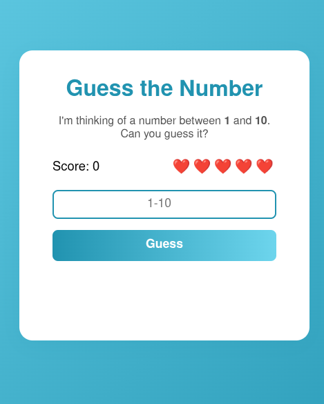

# 🎲 Guess the Number Game

Welcome to **Guess the Number** – a fun, interactive web game built with HTML, CSS, and JavaScript!  
Test your luck and logic by guessing a secret number between **1 and 10**. Can you win before your hearts run out?

---

## 🚀 Features

- **Responsive Design:** Play on mobile, tablet, or desktop.
- **Score System:** Track your wins and improve your high score.
- **Heart Lives:** You get 5 hearts per round. Each wrong guess costs a heart!
- **Instant Feedback:** See if your guess is too high, too low, or correct.
- **Restart Option:** Play again with a single click.
- **Modern UI/UX:** Clean, colorful, and easy to use.

---

## 🕹️ How to Play

1. **Enter your guess** (1-10) in the input box.
2. **Click "Guess"** or press Enter.
3. If your guess is wrong, you lose a heart.  
   If your guess is right, you score a point!
4. **Game Over** when you run out of hearts.
5. Click **Restart** to play again and beat your score!

---

## 📸 Screenshot

---

## 💻 Technologies Used

- **HTML5** for structure
- **CSS3** for styling and responsiveness
- **JavaScript** for game logic

---

## 📦 Setup & Usage

1. **Clone or download** this repository.
2. Open `index.html` in your browser.
3. Start guessing and have fun!

---

## ✨ Customization

- Change the range (e.g., 1-100) in `script.js` for a harder challenge.
- Adjust heart count for more or less difficulty.
- Style the game further in `style.css`.

---

## 🧑‍💻 Author

Made by Jernish,  
Feel free to fork, modify, and share!

---

## 📜 License

This project is licensed under the MIT License. See the [LICENSE](LICENSE) file for details.

---

## 🤝 Contributing

1. Fork the repository.
2. Create a new branch (`git checkout -b feature/AmazingFeature`).
3. Make your changes.
4. Commit your changes (`git commit -m 'Add some AmazingFeature'`).
5. Push to the branch (`git push origin feature/AmazingFeature`).
6. Open a pull request.

---

## 📫 Contact

For inquiries, please email [jernishamala9@gmail.com](mailto:jernishamala9@gmail.com).

---

## 🌟 Acknowledgments

- Inspired by classic number-guessing games.
- Built as a learning project for mastering web development fundamentals.